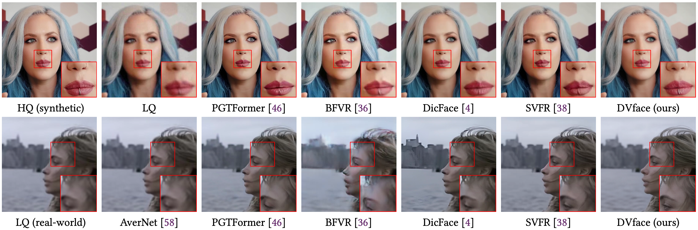
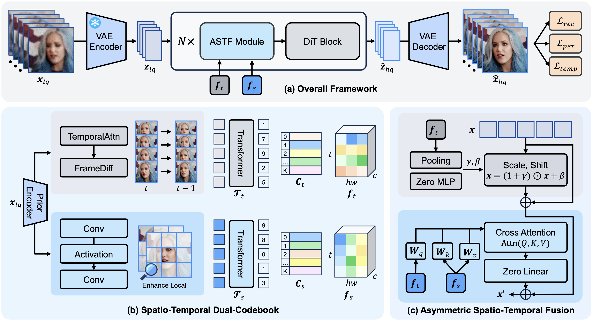
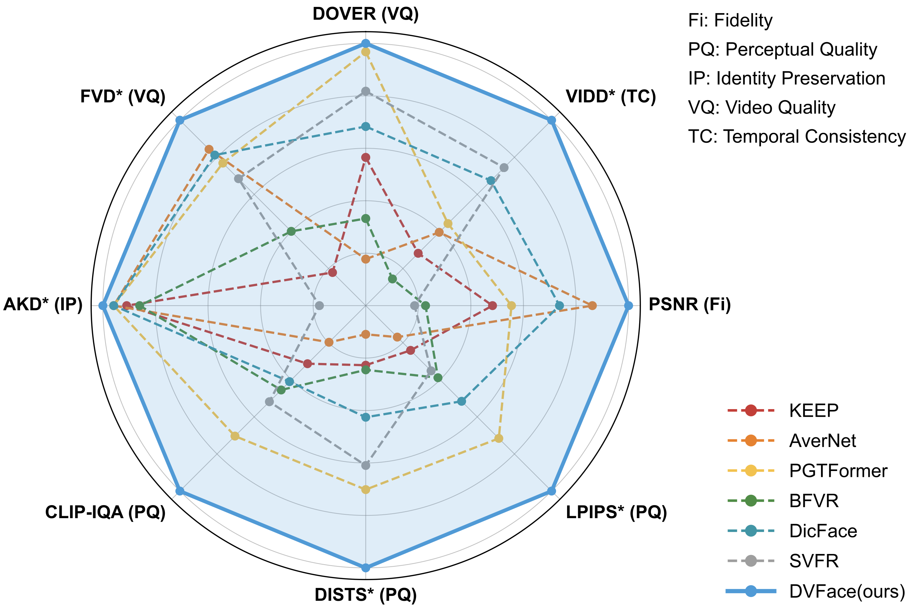
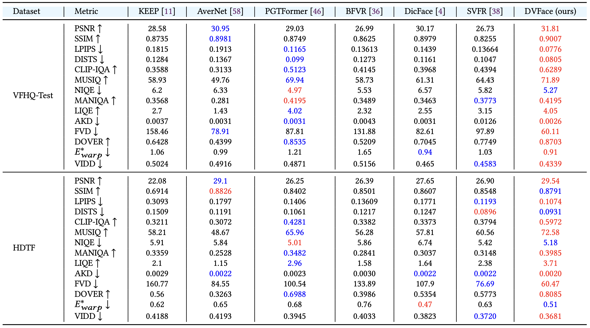
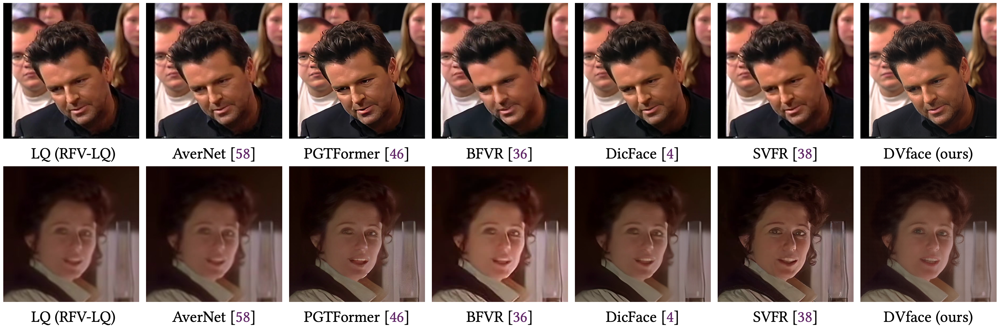
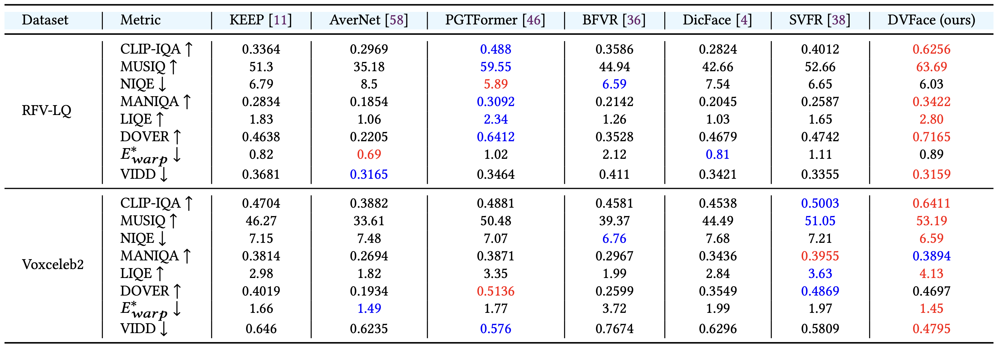
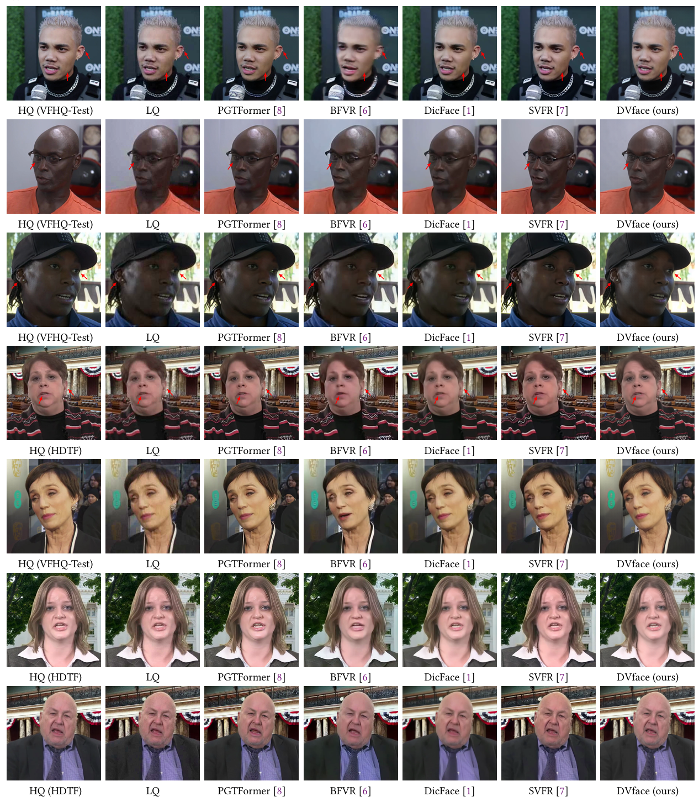
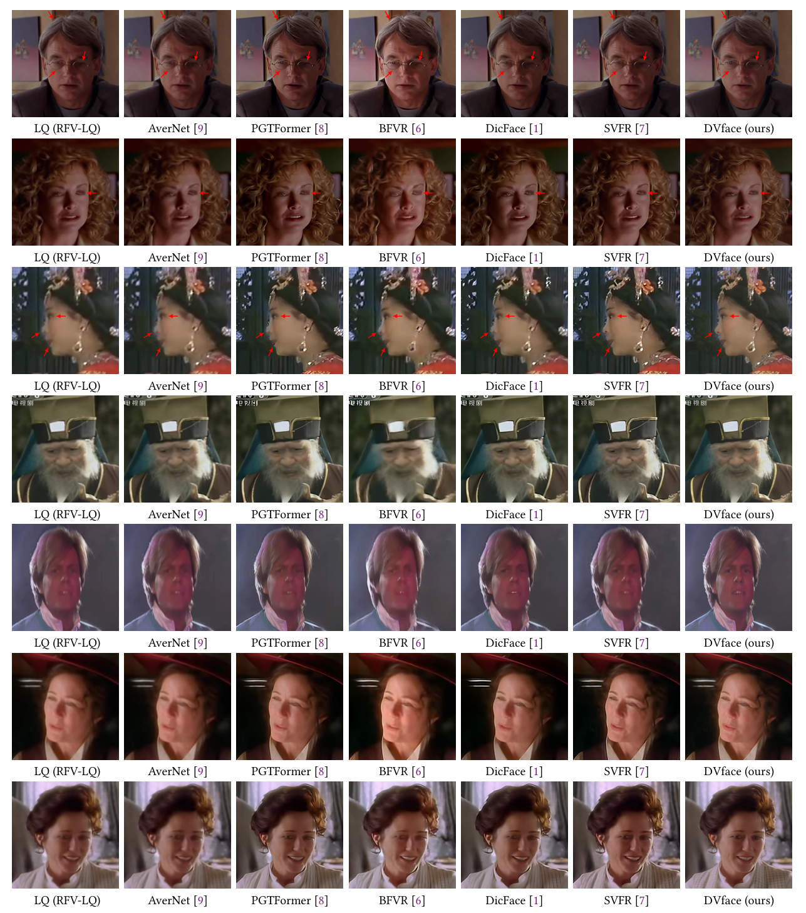

# DVFace: Spatio-Temporal Dual-Prior Diffusion for Video Face Restoration

[Zheng Chen](https://zhengchen1999.github.io/), [Bowen Chai](https://github.com/bowenchai), [Rongjun Gao](https://github.com/rongjungao040803), [Mingtao Nie](https://github.com/lemondrops608), [Xi Li](), [Bingnan Duan](https://github.com/Bingnan), [Jianping Fang](https://www.meituan.com/), [Xiaohong Liu](https://jhc.sjtu.edu.cn/~xiaohongliu/), [Yulun Zhang](https://yulunzhang.com/),"DVFace: Spatio-Temporal Dual-Prior Diffusion for Video Face Restoration", arXiv, 2026

<div>
<a href="https://github.com/zhengchen1999/DVFace/releases" target='_blank' style="text-decoration: none;"></a>
<a href="https://github.com/zhengchen1999/DVFace" target='_blank' style="text-decoration: none;"></a>
<a href="https://github.com/zhengchen1999/DVFace/stargazers" target='_blank' style="text-decoration: none;"></a>
</div>

[[project](https://zhengchen1999.github.io/DVFace)] [[arXiv](wait to be updated)] [[supplementary material](https://github.com/zhengchen1999/DVFace/releases/download/v1/Supplementary_Material.pdf)] [dataset] [pretrained models]


#### 🔥🔥🔥 News

- **2026-04-15:** This repo is released.

---

> **Abstract:** Video face restoration aims to recover high-quality face videos from severely degraded inputs while preserving realistic facial details, stable identity, and temporal coherence. Recent diffusion-based methods have brought strong generative priors to restoration and enabled more realistic detail synthesis. However, existing approaches for face videos still rely heavily on generic diffusion priors and multi-step sampling, which limits both facial adaptation and inference efficiency. These limitations motivate the use of one-step diffusion for video face restoration, but achieving faithful facial recovery together with temporally stable outputs remains challenging. In this paper, we propose **DVFace**, a one-step diffusion framework for real-world video face restoration. Specifically, we introduce a spatio-temporal dual-codebook design to extract complementary spatial and temporal facial priors from degraded videos. We further propose an asymmetric spatio-temporal fusion module to inject these priors into the diffusion backbone according to their distinct roles. Extensive experiments on synthetic and real-world benchmarks demonstrate that DVFace achieves superior restoration quality, temporal consistency, and identity preservation compared with recent methods.



---

### Overall



---

### Radar Figure



## 🔖 TODO

- [ ] Release code and pretrained models

## <a name="results"></a>🔎 Results

<details open>
<summary>Quantitative Results (click to expand) and Qualitative Results (click to expand)</summary>

- Results in Tab. 1 and Fig. 4 of the main paper(synthetic dataset)

<p align="center">
  
  
</p>


- Results in Tab. 2 and Fig. 5 of the main paper(real-world dataset)

<p align="center">
  
  
</p>
<details>

<summary>More Qualitative Results</summary>


- More results in Fig. 2 of the supplementary material(synthetic dataset)

<p align="center">
  
</p>

- More results in Fig. 3 of the supplementary material(real-world dataset)

<p align="center">
  
</p>
</details>

## <a name="citation(Wait to be updated)"></a>📎 Citation

If you find the code helpful in your research or work, please cite our work.

```
@article{chen2026dvface,
              title = {DVFace: Spatio-Temporal Dual-Prior Diffusion for Video Face Restoration},
              author = {Zheng Chen, Bowen Chai, Rongjun Gao, Mingtao Nie, Xi Li, Bingnan Duan, Jianping Fang, Xiaohong
              Liu, Linghe Kong, Yulun Zhang},
              journal = {},
              year = {2026}
              }
```


## <a name="acknowledgements"></a>💡 Acknowledgements

This project is based on [Wan2.1](https://github.com/Wan-Video/Wan2.1).